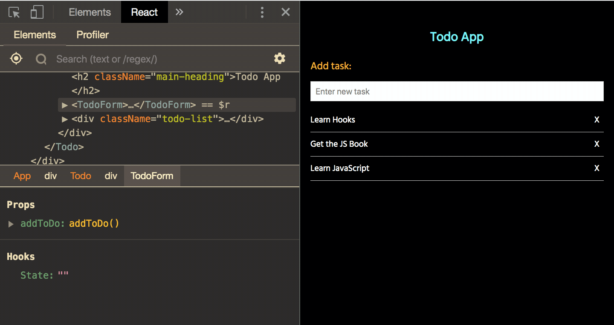

# React Hooks

:anchor: A demo app for React Hooks.

## What are React Hooks?

> * A Hook is a special function that lets you “hook into” React state and lifecycle features.
> * Hooks are a new addition in React 16.8, which allow you to use state and other React features without writing a class.
> * For example, useState is a Hook that lets you add React state to function components. Hooks dont work inside classes

## When would I use a Hook?
 * If you write a function component and realize you need to add some state to it, previously you had to convert it to a class 

## Why use React Hooks?

* They avoid the confusion of `this` keyword and bind this.
* Classes don’t minify very well, and they make hot reloading flaky and unreliable
* Allow you to reuse stateful logic, without changing your component hierarchy( or wrapping them into a HOC ).
* Complex components become hard to understand.
> * Example components might perform some data fetching in `componentDidMount` and `componentDidUpdate`, 
> * However, the same `componentDidMount` method might also contain some unrelated logic that sets up event listeners, with cleanup performed in `componentWillUnmount`
> * We can perform all operations in just one hook `useEffect()`, that we used to perform in three different lifecycle methods ComponentDidMount, ComponentWillUnmount and ComponentDidUpdate.
> * For Example, we can perform all operations (effects) in one hook `useEffect()`, when we want an operation to be performed on every render. In classes we had to do the
same operation in both ComponentDidMount and ComponentDidUpdate.
> * Lifecycle methods of a class often contain unrelated logic, but related logic gets broken up into several methods.

* Unlike componentDidMount or componentDidUpdate, effects scheduled with useEffect don’t block the browser from updating the screen. This makes your app feel more responsive.
* Forgetting to handle componentDidUpdate properly is a common source of bugs in React applications. Hooks solve this problem because [effect cleanup phase](https://reactjs.org/docs/hooks-effect.html#explanation-why-effects-run-on-each-update) happens after every re-render.
So There is no special code for handling updates because useEffect handles them by default. It cleans up the previous effects before applying the next effects
* Sometimes its difficult to break components into smaller ones because the stateful logic is all over the place, making them difficult to test.

## Difference between State of a Class Vs Hook?

* Unlike this.state, the state in hooks doesn’t have to be an object. We can keep it a number, string or an array.
* You can use the State Hook more than once in a single component

```ruby
function ExampleWithManyStates() {
  // Declare multiple state variables!
  const [age, setAge] = useState(42);
  const [fruit, setFruit] = useState('banana');
  const [todos, setTodos] = useState([{ text: 'Learn Hooks' }]);
  // ...
}
``` 

## Features of Hooks?

* Completely opt-in
* 100% backwards-compatible
* Split one component into smaller functions based on what pieces are related (such as setting up a subscription or fetching data)
* Hooks let you use more of React’s features without classes.
* Reuse functionality between components. 

## Rules of Hooks

* Hooks should be called at the top level. Don’t call Hooks inside loops, conditions, or nested functions
* Hooks should be called from React function components. Don’t call Hooks from regular JavaScript functions
* There are linter plugins for check this rule [eslint-plugin-react-hooks](https://www.npmjs.com/package/eslint-plugin-react-hooks)

## Types of Hooks?

#### 1. State Hook : `useState()`
   * `useState` takes initialState and returns a pair ( an array with two items ): the current state value
    and a function that lets you update it
   
   ```ruby
   const [count, setCount] = useState( initialState );
   ```
   
   * Calling `useState()` like above, declares a state variable (count).The first time our component renders, its value will be equal to initialState.
    The next time our component renders its value will be equal to current State ( which will be same as initial state 
    unless the setCount() updates its value )
    
   * When `setCount( 1 )` is called with a new value, React re-renders your component, passing new state (count) value to it.  
   
   * `useState` is similar to this.setState in a class, except it doesn’t merge the old and new state together
   
#### 2. Effect Hook: `useEffect()`

  * Operations like data fetching, subscriptions, or manually changing the DOM from React components are called “side effects” or "effects",
  because they can affect other components and can’t be done during rendering.
  
  * `useEffect`, adds the ability to perform side effects from a function component. It serves the same purpose as componentDidMount, componentDidUpdate, and componentWillUnmount in React classes.
  
  * By default, React runs the effects after every render — including the first render. So `useEffect()` is called on initial render, when state changes ( component updates ) and when component unmounts.
   
  * Just like with useState, you can use more than a single effect in a component
  
  * ##### `Effects that don't require cleanup`: 
  > are the operations we perform after React has updated the DOM ( after render is called ).
  For example network request, user login. useEffect takes a function , that can be called 'effects' because it performs some operations.
  Some of these functions ( effects ), passed as a parameter, might require cleanup so they return a function, which we will discuss below.
  
  ```ruby
      useEffect( () => {
      	console.warn( 'mounted/updated: Do Something( Fetch API, Add Event )' );      
      } );
  ```
  
  * ##### `Effects that do require cleanup`: 
  > are the operations where we may want to set up a subscription to some external data source. So its important
  to cleanup to avoid memory leak. If your effect returns a function, React will run it when it is time to clean up on unmounts and re-render. Function return is optional
  and is required only if we require cleaning. Please note the this return function is called when the component unmounts and on every re-render.
  
  ```ruby
      useEffect( () => {
      
      	console.warn( 'mounted/updated: Do Something( Fetch API, Add Event )' );
      
      	return () => console.warn( 'unmounted: Do Something( Unsuscribe, Remove Event )' );
      } );
  ``` 
  
  * ##### `Skipping Effect for Perforance Optimization`:  
  You can tell React to skip applying an effect if certain values haven’t changed between re-renders. To do so, pass an array as an optional second argument to useEffect:
  In below case if the value of 'count'( state variable ) does not change then the effect ( function passed as a parameter in useEffect ) will not run.
  If you want to run an effect and clean it up only once (on mount and unmount), you can pass an empty array ([]) as a second argument
  
  ```ruby
        useEffect( () => {
        
        	console.warn( 'mounted/updated: Do Something( Fetch API, Add Event )' );
        
        	return () => console.warn( 'unmounted: Do Something( Unsuscribe, Remove Event )' );
        }, [count] );
   ```
   
   * You can define multiple useEffect() in a component.
   Hooks let us split the code based on what it is doing rather than a lifecycle method name.
    React will apply every effect used by the component, in the order they were specified.
     
  
#### 3. `useConText()`

  * `useConText` lets you subscribe to React context without introducing nesting 
  
  * Create AppContext and AppProvider out of it.
  
  ```ruby
  import React, { useState } from 'react';
  export const AppContext = React.createContext([
  	{},
  	() => {}
  ]);
  
  export const AppProvider = ( props ) => {
  
  	const [ state, setState ] = useState();
  
  	return (
  		<AppContext.Provider value={ [ state, setState ] }>
  			{ props.children }
  		</AppContext.Provider>
  	);
  };
  ```
  
  * Wrap your main component with AppProvider
  
  ```ruby
  import { AppProvider } from "../context/AppContext";
  const Index = ( props ) => {
     return (
        <AppProvider>
           <div>
              <AddToCartButton>
           </div>
        </AppProvider>
     );
  };
  
  export default Index;
  ```
  
  * Then use `useContext( AppContext )` in any component to access a global context since `<AppProvider>` wrapped your main component above
  
  ```ruby
  import { useContext } from 'react';
  import { AppContext } from "./context/AppContext";
  
  const AddToCartButton = ( props ) => {
  	const [ state, setState ] = useContext( AppContext );
  	const handleAddToCartClick = () => {
          setState( 'new cart' );
  	};
  	return(
  		<React.Fragment>
  			<button onClick={ handleAddToCartClick } className="btn btn-secondary">Add to cart</button>
  		</React.Fragment>
  	)
  };
  ```
  
  

#### 4. `useReducer()`
  
  * `useReducer` lets you manage local state of complex components with a reducer   
  
#### 5. `useCallback()`

  * Returns a memoized callback  
  
#### 6. `useMemo()`

  * Returns a memoized value  

#### 7. `useRef()`

  * Returns a mutable ref object whose .current property is initialized to the passed argument (initialValue)
  
#### 8. `useImperativeHandle()`

  * Customizes the instance value that is exposed to parent components when using ref     

#### 9. `useLayoutEffect()`

  * The signature is identical to useEffect, but it fires synchronously after all DOM mutations. Use this to read layout from the DOM and synchronously re-render.         

#### 10. `useDebugValue()`

  * Used to display a label for custom hooks in React DevTools.  
  
## How does React associate Hook calls with components?

  * React keeps track of the currently rendering component.
  * There is an internal list of `“memory cells”` associated with each component. They’re just JavaScript objects where we can put some data.
  * When you call a Hook like `useState()`, it reads the current cell (or initializes it during the first render), and then moves the pointer to the next one.
  * This is how multiple useState() calls each get independent local state.

## How do lifecycle methods correspond to Hooks?

* `constructor`: Function components don’t need a constructor. You can initialize the state in the useState call.
* `getDerivedStateFromProps`: Schedule an update while rendering instead.
* `render`: This is the function component body itself.
* `componentDidMount`, `componentDidUpdate`, `componentWillUnmount`: The useEffect Hook can express all combinations of these (including less common cases).
* `componentDidCatch` and `getDerivedStateFromError`: There are no Hook equivalents for these methods yet, but they will be added soon.


## Installation :wrench:

* Clone this repo in `git clone https://github.com/imranhsayed/react-hooks`

* `cd react-hooks`

* Run `npm install`

## Branches Information

1. `useState Example:` [increment-counter](https://github.com/imranhsayed/react-hooks/tree/increment-counter) Simple Example for a State Hook `useState`,  by incrementing counter on click of a button.
2. `useState Example:` [todo-app](https://github.com/imranhsayed/react-hooks/tree/todo-app) Example of creating a Todo App using React Hooks
3. `useEffect Example:` [hierarchical-components](https://github.com/imranhsayed/react-hooks/tree/hierarchical-components) Example for Parent Child Component, where useEffect gets called when Component Mounts or Unmounts.

### Todo App Demo :video_camera:



## Commands :computer:

- `dev` Runs webpack dev server for development ( in watch mode )
- `prod` Runs webpack in production mode

